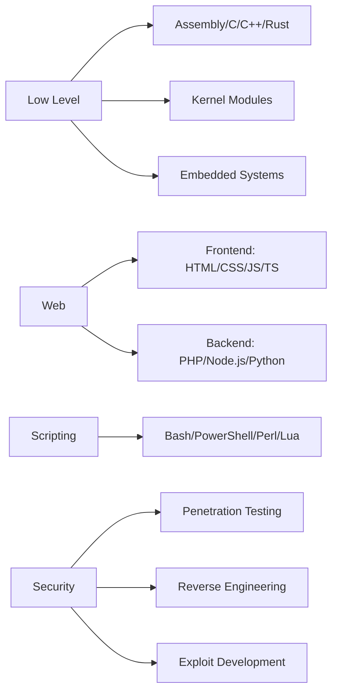

# Lutfifakee

<p align="center">
  
  <br>
  
</p>

---
Hello, world! I'm Lutfifakee a developer, cybersecurity enthusiast, and founder of PadanBlackHat Team, exploring the depths of the digital world. By day, I build and refine code with precision and efficiency. By night, I dive into penetration testing, identifying vulnerabilities and strengthening system defenses.

<p align="center">
  <i>"The only secure system is the one that's powered off. And even that's questionable."</i>
</p>

## Whoami

```bash
> sudo whoami
root@lutfifakee:~$ root
```

```nim
let identity = "Lutfifakee-Project"
echo "Hello, world! I'm ", identity, " - a digital ghost roaming the halls of cyberspace."
```

---

## Language Matrix

### Hardware-Near Languages (Speaking directly to the silicon)
```
Assembly    ■■■■■■■■■■ 100% - Talking to CPUs in their native tongue
C           ■■■■■■■■■■ 100% - The godfather of system programming
C++         ■■■■■■■■■□ 95%  - When objects meet performance
Rust        ■■■■■■■■■□ 95%  - Memory-safe without garbage collection
Zig         ■■■■■■■□□□ 75%  - Modern take on system programming
```

### Web Development (Crafting digital experiences)

**Frontend:**
```
HTML        ■■■■■■■■■■ 100% - The skeleton of the web
CSS         ■■■■■■■■■■ 100% - Making things beautiful
JavaScript  ■■■■■■■■■■ 100% - The language that runs the world
TypeScript  ■■■■■■■■■□ 95%  - JavaScript with superpowers
Dart        ■■■■■■■□□□ 75%  - Flutter's native tongue
```

**Backend:**
```
PHP         ■■■■■■■■■■ 100% - Powering 80% of the web
Node.js     ■■■■■■■■■■ 100% - JavaScript on the server
Python      ■■■■■■■■■■ 100% - The Swiss Army knife
Java        ■■■■■■■■■□ 95%  - Enterprise-grade robustness
Go          ■■■■■■■■■□ 95%  - Concurrency done right
Ruby        ■■■■■■■□□□ 80%  - Developer happiness first
C#          ■■■■■■■□□□ 80%  - Microsoft's finest
Kotlin      ■■■■■■□□□□ 70%  - Java but better
Swift       ■■■■■■□□□□ 70%  - Apple's ecosystem
```

### Most Frequently Used (My daily drivers)
```
Bash        ■■■■■■■■■■ 100% - Automating everything
PowerShell  ■■■■■■■■■□ 95%  - When Windows needs some love
Perl        ■■■■■■■■■■ 100% - The duct tape of the internet
Lua         ■■■■■■■■■■ 100% - Embedding scripts everywhere
```

---

## Tech Stack Visualization

<p align="center">
  
</p>

---

## Architecture Expertise



---

## Arsenal

### Core Weapons
| Category | Tools & Technologies |
|----------|---------------------|
| Primary Languages | Python, JavaScript/TypeScript, PHP, C/C++, Assembly |
| Web Stack | HTML5, CSS3, React.js, Node.js, Express.js, Laravel |
| Pentesting | Metasploit, Burp Suite Pro, Nmap, Wireshark, SQLmap, Ghidra |
| Security | Firewall Configuration, IDS/IPS, Cryptography, Reverse Engineering |
| Databases | MySQL, MongoDB, PostgreSQL, Redis, SQLite |
| DevOps & Tools | Docker, Kubernetes, Jenkins, Git, Vagrant, Ansible |
| Scripting | Bash, PowerShell, Perl, Lua, AWK, Sed |

---

## Certifications & Achievements

```
┌─────────────────────────────────────┐
│  OSCP  ■■■■■■■■■■  Certified        │
│  CEH   ■■■■■■■■■■  Certified        │
│  HTB   ■■■■■■■■■■  Top 5% Global    │
│  CVE   ■■■■■■■■■■  Multiple Finds   │
└─────────────────────────────────────┘
```

- OSCP (Offensive Security Certified Professional)
- CEH (Certified Ethical Hacker)
- Top 5% in HackTheBox Global Rankings
- Multiple CVEs Discovered & Credited
- Bug Bounty Hall of Fame Member

---

## GitHub Stats

<p align="center">
  
</p>

---

## Current Operations

```
[ACTIVE] Working on: Advanced penetration testing automation tools
[LEARNING] Blockchain security & Smart Contract auditing
[OPEN] Looking to collaborate: Open-source security tools
[EXPERT] Ask me about: Ethical hacking, Network security, Exploit development
[FUN] Fact: I can crack a Wi-Fi password faster than you can say "cybersecurity"
```

---

<p align="center">
  
</p>

<p align="center">
  
</p>

<p align="center">
  
</p>
