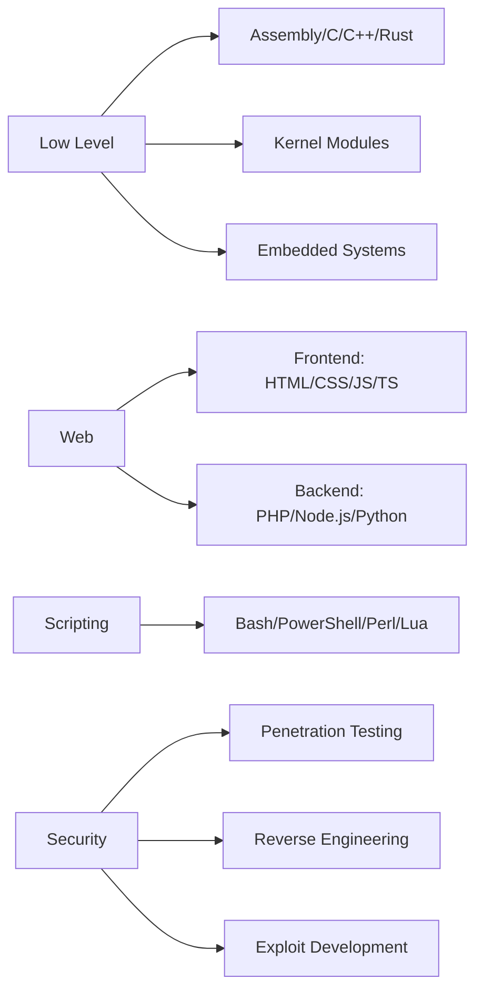

# Lutfifakee

<p align="center">
  
  <br>
  
</p>

---
Hello, world! I'm Lutfifakee a developer, cybersecurity enthusiast, and founder of PadanBlackHat Team, exploring the depths of the digital world. By day, I build and refine code with precision and efficiency. By night, I dive into penetration testing, identifying vulnerabilities and strengthening system defenses.

<p align="center">
  <i>"The only secure system is the one that's powered off. And even that's questionable."</i>
</p>

## Whoami

```bash
> sudo whoami
root@lutfifakee:~$ root
```

```nim
let identity = "Lutfifakee-Project"
echo "Hello, world! I'm ", identity, " - a digital ghost roaming the halls of cyberspace."
```

---

## Tech Stack Visualization

<p align="center">
  
</p>

---

## Architecture Expertise



## GitHub Stats

<p align="center">
  
</p>

---

## Contributing
<p>Contributions are welcome! If you have suggestions for improvements or new features, feel free to open an issue or submit a pull request.</p>
<p>Thanks for visiting my GitHub profile! Feel free to contact me if you have any questions or if you would like to collaborate on a project.</p>

---

<p align="center">
  
</p>

<p align="center">
  
</p>

<p align="center">
  
</p>
